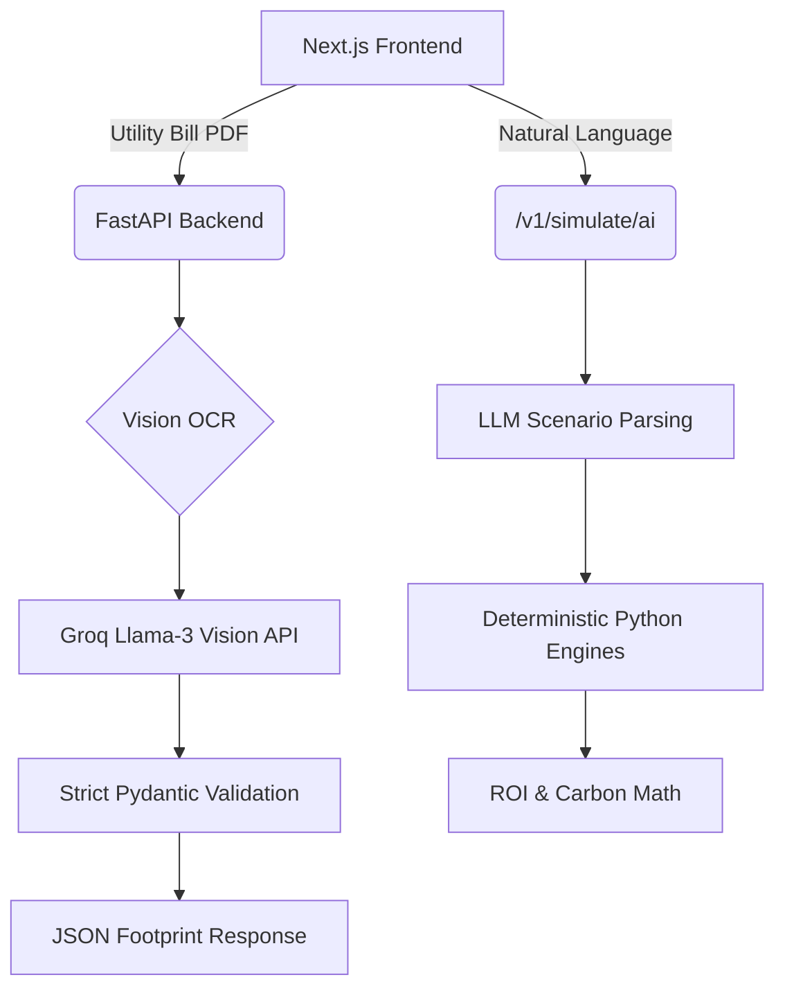

# CarbonPilot AI 🌍 

**Understand, Track, and Reduce Your Carbon Footprint in Under 2 Minutes.**

  

CarbonPilot is a frictionless, zero-setup platform built to tackle the cognitive overload of climate action. We replace tedious manual data entry with AI-powered OCR, and we replace generic climate advice with context-aware, mathematically rigorous simulations. 

---

## 🏆 The Problem & Our Solution

**The Problem:** Most carbon footprint calculators require 15-30 minutes of tedious data entry. Users drop off before they even see their baseline. Furthermore, the advice provided is often generic (e.g., "Install Solar Panels" to a user who already has them or rents an apartment).

**The Solution:**
1. **Zero-Friction Onboarding:** Drag and drop your utility bill. Our Multimodal OCR pipeline instantly extracts your exact kWh usage, location, and billing cycle.
2. **Personalized Context:** We rank reduction actions dynamically against *your specific data*. 
3. **Natural Language Simulations:** Want to know the impact of buying an EV *and* switching to a vegan diet? Just ask. Our hybrid AI architecture strictly parses natural language into deterministic mathematical scenarios.

**Why It's Different:** We don't use AI to guess math. We use AI exclusively for unstructured parsing (OCR and Natural Language), while our Python backend handles deterministic ROI, break-even, and CO₂ reduction math. This guarantees accurate, hallucination-free financial and environmental modeling.

### Why AI Does Not Calculate Emissions
CarbonPilot explicitly partitions AI capabilities to prevent hallucinations in sustainability metrics.
* **OCR Usage:** AI is used strictly for entity extraction from unstructured utility bill PDFs.
* **Parsing Usage:** Natural language scenarios ("buy an EV") are mapped to deterministic JSON flags.
* **Deterministic Calculations:** All ROI, break-even timelines, and CO₂e calculations execute in `carbon_engine.py` and `simulation_engine.py` using hardcoded math. The LLM never touches the final numbers.

---

## 🧠 Smart Assistant & Context-Aware Logic

CarbonPilot features a strictly delineated AI workflow:

* **Smart Assistant:** The `/v1/simulate/ai` endpoint allows natural language scenario stacking. A user types, *"What if I commute by bike and go vegan?"* The LLM maps this to rigorous JSON parameters (`action: transport_bike`, `action: diet_vegan`).
* **Contextual Decision Making:** Our `ranking_engine.py` re-evaluates all recommendations based on your current baseline. If your utility bill proves you use 450 kWh of grid energy, solar panels rank highly. If you manually indicate you use 100% renewable energy, solar panels drop to the bottom of the list.

---

## 🏗 Technical Architecture

CarbonPilot is a fully decoupled, stateless application designed for immense scalability.



* **Frontend:** Next.js 14, React 19, TailwindCSS 4. Deployed seamlessly with Firebase App Hosting.
* **Backend:** FastAPI (Python). Highly concurrent and strictly validated using Pydantic models. Deployed on Google Cloud Run.
* **Engines:** Segmented into `carbon_engine.py`, `simulation_engine.py`, and `ranking_engine.py`.
* **State Management:** Stateless backend. User sessions are persisted entirely client-side via `localStorage`, eliminating the need for complex, unscalable database infrastructure during the hackathon phase.

---

## 🔒 Security & Privacy by Design

* **Zero-Retention OCR:** Utility bills are processed entirely in-memory and instantly discarded. Nothing is written to an unencrypted disk.
* **No Database:** Because state lives in the browser, a backend breach yields exactly zero user records.
* **Strict Validation:** Every API endpoint validates payloads using strict Pydantic schemas, preventing injection attacks.

---

## 🧪 Testing & Reliability

* **Backend:** Comprehensive `pytest` coverage for all deterministic engines (Math, Simulation, Carbon Baseline) and API routing.
* **Frontend:** A robust, mocked Playwright E2E suite covering all 6 core user flows across Chromium, Firefox, and WebKit.
  * Flow 1: OCR Upload Journey
  * Flow 2: Manual Entry Fallback
  * Flow 3: Recommendation Engine
  * Flow 4: Scenario Simulator
  * Flow 5: AI Natural Language Parsing
  * Flow 6: Accessibility Audits
* **Execution Time:** The entire UI test suite executes in < 15 seconds.

---

## ♿ Accessibility

Tested rigorously using `@axe-core/playwright`.
* 100% semantic HTML5 tags.
* Native keyboard navigation and focus management.
* Comprehensive `aria-labels` and `sr-only` descriptions for all dynamic elements and forms.

---

## 🚀 Quick Start Demo

**Prerequisites:** Node.js (v20+), Python (3.10+)

1. **Start the Backend:**
   ```bash
   cd backend
   cp .env.example .env
   # IMPORTANT: Open .env and insert your GROQ_API_KEY
   uv venv
   source .venv/bin/activate
   uv pip install -e .
   uvicorn app.main:app --reload
   ```

2. **Start the Frontend:**
   ```bash
   cd frontend
   npm install
   npm run dev
   ```

3. **Experience the Magic:**
   * Navigate to `http://localhost:3000`
   * Click **Get Started**
   * Drag and drop the `sample_bill.pdf` provided in the repository to bypass manual entry.
   * View your footprint and navigate to the **Simulator** tab.
   * Type: *"Switch to an EV and adopt a vegan diet"* and hit Simulate.

---

## ☁️ Deployment

### Backend (Google Cloud Run)
```bash
cd backend
gcloud run deploy carbonpilot-backend \
  --source . \
  --allow-unauthenticated \
  --memory 2Gi \
  --set-env-vars="GROQ_API_KEY=your_key,ENVIRONMENT=production,CORS_ORIGINS=https://[your-firebase-url]"
```

### Frontend (Firebase Hosting)
```bash
cd frontend
echo "NEXT_PUBLIC_API_URL=https://[your-cloud-run-url]/v1" > .env.production
npm run build # Exports static site
firebase deploy --only hosting
```

---

## 🌍 Sustainability Methodology

Our calculations are rigorously backed by verifiable scientific sources to ensure accurate, defensible carbon modeling.

* **Grid Intensity & Heating**: Based on the **EPA eGRID 2023** database for US regional baselines, utilizing average `kgCO2e/kWh` multipliers.
* **Transport & Flights**: Adapted from **DEFRA 2023** conversion factors, applying a 1.9x radiative forcing multiplier for aviation emissions.
* **Diet & Consumption**: Baselines sourced from **IPCC AR6** WGIII and the **IEA 2023** sector reports.
* **Known Limitations:** In-memory rate limiting will isolate buckets across Cloud Run scaling instances.
